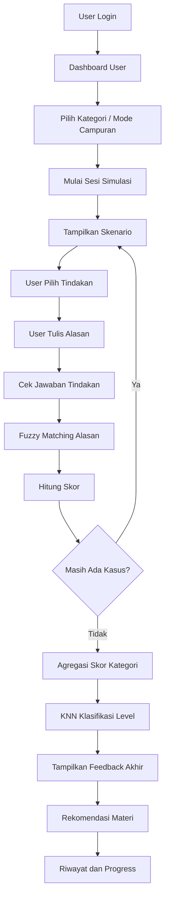
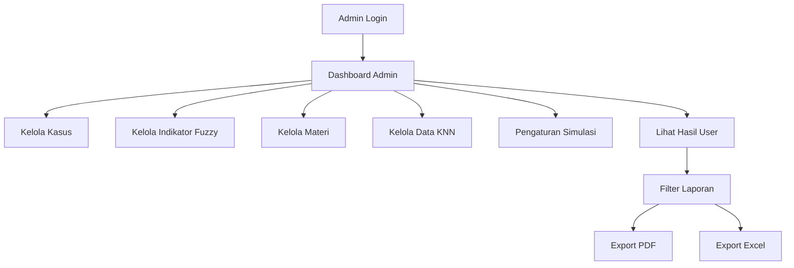
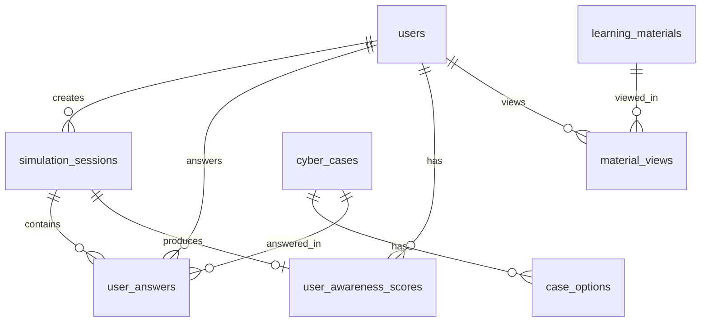

# PRD - Product Requirements Document

# SITANGKAS

## Sistem Interaktif Tanggap Ancaman Keamanan Siber menggunakan KNN dan Fuzzy Matching

**Nama sistem:** SITANGKAS  
**Kepanjangan:** Sistem Interaktif Tanggap Ancaman Keamanan Siber  
**Judul project:** Intelligent Tutor System untuk Cyber Awareness Menggunakan KNN dan Fuzzy Matching Berbasis Web  
**Platform:** Web Application  
**Framework utama:** Laravel 13  
**Database:** MySQL  
**Target utama:** Masyarakat awam pengguna internet  
**Role sistem:** Admin dan User  
**Metode utama:** Fuzzy Matching dan K-Nearest Neighbor (KNN)  
**Jenis dokumen:** Product Requirements Document (PRD)  
**Versi dokumen:** 1.0

---

## 1. Ringkasan Produk

SITANGKAS adalah aplikasi web berbasis Intelligent Tutor System (ITS) untuk melatih masyarakat awam mengenali ancaman digital sehari-hari melalui simulasi kasus nyata. Sistem tidak hanya menampilkan pertanyaan benar atau salah, tetapi membawa user masuk ke skenario seperti menerima SMS hadiah palsu, email phishing, link login palsu, permintaan OTP, chat marketplace mencurigakan, password lemah, pinjaman online ilegal, QRIS palsu, APK undangan palsu, dan modus lowongan kerja palsu.

Dalam setiap simulasi, user memilih tindakan yang menurutnya paling aman, lalu menulis alasan mengapa tindakan tersebut dipilih. Sistem kemudian melakukan dua proses utama:

1. **Fuzzy Matching** untuk mencocokkan alasan user dengan indikator bahaya yang seharusnya dikenali.
2. **KNN** untuk mengklasifikasikan level cyber awareness user menjadi **Beginner**, **Intermediate**, atau **Advanced** berdasarkan performa latihan.

SITANGKAS dirancang sebagai sistem pembelajaran adaptif yang memberi feedback tutor, skor, level pemahaman, dan rekomendasi materi sesuai kelemahan user.

---

## 2. Alasan Pemilihan Nama Sistem

### 2.1 Nama Sistem

**SITANGKAS**

### 2.2 Kepanjangan Nama

**Sistem Interaktif Tanggap Ancaman Keamanan Siber**

### 2.3 Makna Nama

SITANGKAS dipilih karena terdengar Indonesia, mudah diingat, dan menggambarkan tujuan sistem: membuat user lebih tanggap, sigap, dan cermat ketika menghadapi ancaman digital sehari-hari. Nama ini juga tidak terlalu formal sehingga cocok untuk target utama masyarakat awam.

| Elemen | Makna |
|---|---|
| Sistem Interaktif | Sistem berbasis web yang mengajak user belajar melalui simulasi, bukan hanya membaca materi. |
| Tanggap Ancaman | User dilatih mengenali tanda bahaya seperti link palsu, OTP scam, SMS hadiah palsu, dan chat penipuan. |
| Keamanan Siber | Fokus pembelajaran pada cyber security awareness yang dekat dengan kehidupan digital masyarakat. |

### 2.4 Tagline

> **Kenali Modusnya. Pilih Aksi Amannya. Jadi Lebih Tanggap Digital.**

---

## 3. Latar Belakang

Penggunaan internet, e-wallet, marketplace, mobile banking, media sosial, dan layanan digital sudah menjadi bagian dari aktivitas harian masyarakat. Namun, tidak semua pengguna memahami risiko keamanan digital yang muncul dari aktivitas tersebut. Banyak kasus penipuan terjadi karena pengguna tidak sadar bahwa link tertentu palsu, OTP tidak boleh dibagikan, transaksi di luar platform berbahaya, password lemah mudah ditebak, atau penawaran hadiah dan pinjaman online sering digunakan sebagai jebakan.

Metode edukasi yang umum digunakan masih banyak berbentuk artikel, video, atau seminar satu arah. Model tersebut kurang memberi pengalaman praktik karena user hanya menerima informasi, bukan dilatih mengambil keputusan dalam kondisi yang menyerupai kasus nyata.

SITANGKAS hadir sebagai media belajar berbasis simulasi. User tidak hanya membaca teori, tetapi menghadapi kasus, memilih tindakan, menuliskan alasan, menerima feedback, melihat level pemahaman, dan mendapatkan rekomendasi materi yang sesuai.

---

## 4. Masalah yang Diselesaikan

| Kode | Masalah | Dampak |
|---|---|---|
| M-001 | Masyarakat awam sering sulit membedakan pesan aman dan pesan berbahaya. | User mudah mengklik link palsu, membalas pesan penipuan, atau mengikuti instruksi penipu. |
| M-002 | User sering tahu jawaban aman, tetapi tidak memahami alasannya. | Pemahaman tidak mendalam dan sulit diterapkan ke kasus lain. |
| M-003 | Edukasi cyber awareness masih banyak yang pasif. | User kurang terlatih mengambil keputusan dalam situasi nyata. |
| M-004 | Kuis biasa hanya menilai benar atau salah. | Sistem tidak mengetahui apakah user benar-benar memahami indikator bahaya. |
| M-005 | Materi edukasi sering tidak personal. | User tidak mendapat rekomendasi sesuai kelemahannya. |
| M-006 | Admin/pengelola membutuhkan cara mudah mengelola kasus dan melihat hasil latihan. | Data pembelajaran sulit dievaluasi. |

---

## 5. Tujuan Sistem

| Kode | Tujuan |
|---|---|
| T-001 | Menyediakan aplikasi web edukasi cyber awareness berbasis simulasi. |
| T-002 | Membantu masyarakat awam mengenali ancaman digital sehari-hari. |
| T-003 | Melatih user memilih tindakan aman ketika menghadapi skenario digital mencurigakan. |
| T-004 | Menilai alasan user menggunakan Fuzzy Matching. |
| T-005 | Mengklasifikasikan level cyber awareness user menggunakan KNN. |
| T-006 | Memberikan feedback tutor yang edukatif setelah user menjawab. |
| T-007 | Memberikan rekomendasi materi berdasarkan kategori yang masih lemah. |
| T-008 | Menyediakan dashboard admin untuk mengelola kasus, indikator, materi, dataset, dan laporan. |

---

## 6. Target Pengguna

### 6.1 Target Utama

Target utama sistem adalah **masyarakat awam pengguna internet**, terutama pengguna yang belum memiliki pemahaman kuat tentang keamanan digital.

Contoh target user:

- Pengguna e-wallet dan mobile banking.
- Pengguna marketplace.
- Pengguna WhatsApp, SMS, email, dan media sosial.
- Pekerja umum yang sering menerima pesan digital.
- Orang tua atau pengguna baru layanan digital.
- Pelajar, mahasiswa, dan masyarakat umum yang ingin belajar keamanan digital dasar.

### 6.2 Karakteristik User

| Aspek | Karakteristik |
|---|---|
| Literasi teknologi | Rendah sampai sedang. |
| Tujuan memakai sistem | Belajar mengenali ancaman digital dengan contoh nyata. |
| Kebutuhan utama | Simulasi sederhana, feedback jelas, dan rekomendasi materi praktis. |
| Hambatan | Tidak memahami istilah teknis cyber security. |
| Preferensi UI | Tampilan sederhana, aman, modern, dan tidak terlalu ramai. |

---

## 7. Ruang Lingkup Sistem

### 7.1 Termasuk dalam Sistem

- Register dan login user.
- Login admin.
- Dashboard user.
- Dashboard admin.
- Pemilihan topik atau kategori simulasi.
- Sesi simulasi cyber awareness.
- Jumlah soal per sesi fleksibel, default 10 kasus.
- Admin dapat mengatur jumlah kasus per sesi.
- User memilih tindakan dari pilihan yang tersedia.
- User menulis alasan jawaban secara bebas.
- Sistem menilai tindakan user.
- Sistem menganalisis alasan user menggunakan Fuzzy Matching.
- Sistem menghitung skor per jawaban dan per kategori.
- Sistem menjalankan KNN untuk menentukan level awareness.
- Sistem menampilkan feedback tutor.
- Sistem memberi rekomendasi materi adaptif.
- User dapat melihat riwayat latihan.
- Admin dapat mengelola dataset kasus.
- Admin dapat mengelola indikator fuzzy.
- Admin dapat mengelola materi edukasi.
- Admin dapat mengelola data training KNN.
- Admin dapat melihat hasil latihan user.
- Admin dapat export laporan ke PDF dan Excel.

### 7.2 Tidak Termasuk dalam Sistem

- Sistem tidak melakukan deteksi serangan cyber secara real-time.
- Sistem tidak memindai URL asli dari internet.
- Sistem tidak membaca email atau SMS asli milik user.
- Sistem tidak menjadi alat investigasi kriminal.
- Sistem tidak menggantikan software antivirus, endpoint protection, atau security monitoring.
- Sistem tidak menggunakan chatbot AI generatif sebagai fitur utama.

---

## 8. Konsep Intelligent Tutor System

SITANGKAS memenuhi konsep Intelligent Tutor System karena memiliki empat komponen utama: **Domain Model**, **Student Model**, **Tutoring Model**, dan **User Interface**.

### 8.1 Domain Model

Domain Model berisi pengetahuan sistem tentang cyber awareness.

Komponen:

- Dataset kasus simulasi.
- Kategori ancaman digital.
- Indikator bahaya ideal.
- Tindakan benar.
- Feedback tutor.
- Materi rekomendasi.

Contoh domain knowledge:

| Kategori | Indikator Bahaya | Tindakan Aman |
|---|---|---|
| Link Phishing | Link tidak resmi, domain mencurigakan, meminta login/data. | Jangan klik link, buka aplikasi/situs resmi secara manual. |
| OTP Fraud | Meminta OTP, PIN, CVV, mengaku petugas. | Jangan berikan kode apa pun. |
| Marketplace Scam | Pembayaran di luar platform, harga terlalu murah, penjual mendesak. | Transaksi hanya di aplikasi resmi. |
| Password Security | Password terlalu umum, berulang, mudah ditebak. | Gunakan password kuat dan unik. |

### 8.2 Student Model

Student Model menyimpan performa dan pemahaman user.

Data yang disimpan:

- Skor per kategori.
- Jumlah jawaban benar.
- Jumlah jawaban salah.
- Rata-rata waktu menjawab.
- Jumlah bantuan/materi yang dibuka.
- Indikator bahaya yang berhasil dikenali.
- Level awareness hasil KNN.
- Riwayat simulasi.

### 8.3 Tutoring Model

Tutoring Model menentukan bagaimana sistem memberi bantuan pembelajaran.

Fungsi:

- Memberi feedback setelah user menjawab.
- Menjelaskan alasan jawaban benar atau salah.
- Menampilkan indikator bahaya yang terdeteksi.
- Menampilkan indikator yang belum dikenali user.
- Memberi rekomendasi materi sesuai kelemahan.
- Mengarahkan user ke latihan berikutnya.

### 8.4 User Interface Model

User Interface Model adalah tampilan sistem yang digunakan user dan admin.

Fokus UI:

- Simulasi dibuat seperti mini scenario card.
- Tindakan user ditampilkan sebagai pilihan yang mudah dipahami.
- Input alasan dibuat sederhana.
- Feedback tutor tampil jelas dan edukatif.
- Dashboard menampilkan level, skor, progress, dan rekomendasi.
- Warna, layout, dan animasi mendukung nuansa profesional, aman, dan modern.

---

## 9. Role dan Hak Akses

## 9.1 User

User adalah masyarakat awam yang mengikuti pembelajaran dan simulasi.

### Fitur User

| Kode | Fitur | Deskripsi |
|---|---|---|
| U-001 | Register | User dapat membuat akun. |
| U-002 | Login | User dapat masuk ke sistem. |
| U-003 | Dashboard | User melihat ringkasan skor, level, progress, dan rekomendasi. |
| U-004 | Pilih Kategori | User memilih topik simulasi. |
| U-005 | Mulai Simulasi | User memulai sesi latihan. |
| U-006 | Jawab Tindakan | User memilih tindakan dari opsi yang tersedia. |
| U-007 | Tulis Alasan | User mengetik alasan bebas. |
| U-008 | Lihat Feedback | User melihat penjelasan tutor setelah menjawab. |
| U-009 | Lihat Level Awareness | User melihat hasil klasifikasi Beginner, Intermediate, atau Advanced. |
| U-010 | Buka Materi | User membaca materi rekomendasi. |
| U-011 | Riwayat Latihan | User melihat hasil simulasi sebelumnya. |

## 9.2 Admin

Admin adalah pengelola sistem, dataset, materi, dan laporan.

### Fitur Admin

| Kode | Fitur | Deskripsi |
|---|---|---|
| A-001 | Login Admin | Admin dapat masuk ke dashboard admin. |
| A-002 | Kelola Kasus | Admin dapat tambah, edit, hapus, import, dan melihat kasus. |
| A-003 | Kelola Pilihan Tindakan | Admin mengatur pilihan jawaban dan tindakan benar. |
| A-004 | Kelola Indikator Fuzzy | Admin mengatur indikator normal, variasi kata, kategori, dan bobot. |
| A-005 | Kelola Materi | Admin membuat materi edukasi per kategori dan level. |
| A-006 | Kelola Training KNN | Admin mengimport atau mengedit data training KNN. |
| A-007 | Pengaturan Simulasi | Admin mengatur jumlah kasus per sesi, default 10. |
| A-008 | Statistik User | Admin melihat performa user, level, kategori lemah, dan progress. |
| A-009 | Export Laporan PDF | Admin export laporan hasil latihan dalam format PDF. |
| A-010 | Export Laporan Excel | Admin export laporan hasil latihan dalam format Excel. |

---

## 10. Dataset yang Digunakan

Sistem menggunakan tiga dataset CSV utama.

### 10.1 cyber_cases_training_id.csv

Dataset ini digunakan sebagai bank kasus simulasi. Berdasarkan file yang digunakan, dataset berisi **162 kasus** dengan beberapa kanal dan kategori ancaman.

#### Kolom Utama

| Kolom | Fungsi |
|---|---|
| id_kasus | ID unik kasus. |
| kanal | Media skenario, misalnya SMS, Email, WhatsApp, Marketplace Chat, Browser/Website, Media Sosial. |
| kategori | Kode kategori kasus. |
| nama_kategori | Nama kategori yang tampil untuk user/admin. |
| teks_skenario | Narasi kasus simulasi yang dibaca user. |
| label_risiko | Label risiko: aman, mencurigakan, atau berbahaya. |
| level_kesulitan | Level kasus: mudah, sedang, atau sulit. |
| has_link | Penanda ada/tidaknya link. |
| has_short_url | Penanda penggunaan short URL. |
| has_suspicious_domain | Penanda domain mencurigakan. |
| asks_otp_pin_cvv | Penanda permintaan OTP, PIN, atau CVV. |
| asks_password | Penanda permintaan password. |
| asks_personal_data | Penanda permintaan data pribadi. |
| has_reward_claim | Penanda klaim hadiah. |
| has_loan_offer | Penanda tawaran pinjaman. |
| has_urgency | Penanda tekanan waktu. |
| asks_transfer_fee | Penanda permintaan transfer/biaya. |
| uses_apk_attachment | Penanda APK/lampiran mencurigakan. |
| outside_official_app | Penanda aktivitas di luar aplikasi resmi. |
| risk_score_rule | Skor risiko berbasis rule. |
| indikator_ideal | Indikator bahaya ideal yang harus dikenali user. |
| tindakan_benar | Tindakan aman yang diharapkan. |
| feedback_tutor | Feedback edukatif dari sistem. |
| basis_sumber | Basis pengetahuan umum/sumber rujukan kasus. |

#### Kategori Kasus yang Didukung Dataset

| Kode Kategori | Nama Kategori | Jumlah Kasus | Prioritas MVP |
|---|---:|---:|---|
| legitimate | Pesan Aman | 18 | Ya |
| phishing_link | Link Phishing | 16 | Ya |
| otp_fraud | Penipuan OTP/PIN/CVV | 16 | Ya |
| pinjol_ilegal | Pinjol Ilegal | 16 | Ya |
| apk_malware | APK/Undangan Palsu | 16 | Ya |
| marketplace_scam | Scam Marketplace | 16 | Ya |
| fake_giveaway | Hadiah/Giveaway Palsu | 16 | Ya |
| job_scam | Lowongan Kerja Palsu | 16 | Opsional |
| password_security | Keamanan Password | 16 | Ya |
| qris_scam | QRIS/Transfer Palsu | 16 | Opsional |

Catatan desain: agar sistem tetap optimal dan tidak terlalu kompleks, MVP dapat menampilkan kategori utama terlebih dahulu, yaitu Link Phishing, OTP Fraud, Password Security, Marketplace Scam, Pinjol Ilegal, APK Palsu, Giveaway Palsu, dan Pesan Aman. Kategori Job Scam dan QRIS Scam dapat tetap disimpan di database dan diaktifkan jika diperlukan.

### 10.2 fuzzy_indicator_dictionary_id.csv

Dataset ini digunakan sebagai kamus Fuzzy Matching. File berisi variasi kata dari indikator bahaya yang mungkin ditulis user.

Jumlah data: **64 variasi kata/indikator**.

#### Kolom Utama

| Kolom | Fungsi |
|---|---|
| indikator_normal | Bentuk indikator resmi. |
| kata_kunci_variasi | Variasi kata yang mungkin diketik user. |
| kategori_relevan | Kategori terkait. Dalam dataset awal banyak bersifat multi. |
| bobot_risiko | Bobot indikator untuk scoring alasan. |

Contoh penggunaan:

| Indikator Normal | Variasi User |
|---|---|
| link tidak resmi | link aneh, tautan palsu, url palsu, alamat web mencurigakan |
| domain mencurigakan | domain aneh, domain bukan resmi |
| meminta OTP | kode otp, kode verifikasi, minta otp |

### 10.3 knn_user_awareness_training.csv

Dataset ini digunakan sebagai data training KNN untuk menentukan level cyber awareness user.

Jumlah data: **240 profil training**.

#### Kolom Utama

| Kolom | Fungsi |
|---|---|
| id_profile | ID profil training. |
| skor_phishing | Skor performa kategori phishing/social engineering. |
| skor_otp | Skor performa kategori OTP/PIN/CVV. |
| skor_password | Skor performa kategori password. |
| skor_marketplace | Skor performa kategori marketplace. |
| skor_pinjol | Skor performa kategori pinjol. |
| jumlah_salah | Total kesalahan user. |
| rata_waktu_detik | Rata-rata waktu menjawab. |
| jumlah_bantuan_dibuka | Jumlah bantuan/materi yang dibuka saat latihan. |
| level_awareness | Label hasil: beginner, intermediate, advanced. |

Distribusi label pada dataset training:

| Level | Jumlah Data |
|---|---:|
| Beginner | 69 |
| Intermediate | 164 |
| Advanced | 7 |

Catatan: karena data Advanced lebih sedikit, sistem perlu menggunakan normalisasi fitur dan evaluasi hasil agar klasifikasi tidak terlalu bias ke Intermediate.

---

## 11. Kategori Simulasi dan Isi Ringkas Materi

### 11.1 Link Phishing

**Tujuan materi:** User memahami ciri link palsu dan cara aman memverifikasi website.

Isi ringkas:

- Jangan langsung klik link dari SMS, email, atau chat yang tidak dikenal.
- Periksa domain resmi, bukan hanya tampilan halaman.
- Waspadai short URL seperti tautan yang dipendekkan.
- Jangan login melalui link yang dikirim mendadak.
- Akses layanan dengan mengetik alamat resmi secara manual atau membuka aplikasi resmi.

### 11.2 OTP Fraud / Penipuan OTP, PIN, dan CVV

**Tujuan materi:** User memahami bahwa OTP, PIN, CVV, dan kode verifikasi adalah rahasia.

Isi ringkas:

- Petugas bank, e-wallet, marketplace, atau ekspedisi tidak akan meminta OTP.
- OTP hanya digunakan oleh pemilik akun untuk verifikasi pribadi.
- Jangan kirim kode melalui chat, telepon, form, atau link apa pun.
- Jika ada pihak mendesak meminta kode, anggap sebagai tanda bahaya.

### 11.3 SMS Scam dan Fake Giveaway

**Tujuan materi:** User mampu mengenali pesan hadiah palsu dan klaim promosi mencurigakan.

Isi ringkas:

- Waspadai pesan “Selamat Anda Menang” dari nomor tidak dikenal.
- Hadiah yang terlalu besar dan tiba-tiba sering digunakan sebagai umpan.
- Jangan membayar biaya administrasi untuk hadiah yang tidak pernah diikuti.
- Verifikasi informasi melalui website atau akun resmi penyelenggara.

### 11.4 Password Security

**Tujuan materi:** User memahami cara membuat dan menjaga password yang aman.

Isi ringkas:

- Hindari password umum seperti 123456, tanggal lahir, nama sendiri, atau qwerty.
- Gunakan kombinasi panjang, unik, dan berbeda untuk setiap akun.
- Aktifkan autentikasi dua faktor jika tersedia.
- Jangan menyimpan password di catatan yang mudah diakses orang lain.

### 11.5 Marketplace Scam

**Tujuan materi:** User memahami cara transaksi aman di marketplace.

Isi ringkas:

- Jangan transaksi di luar aplikasi resmi.
- Hindari transfer langsung ke rekening pribadi sebelum barang jelas.
- Periksa rating, ulasan, dan riwayat toko.
- Waspadai harga terlalu murah dan penjual yang mendesak.

### 11.6 Pinjaman Online Ilegal

**Tujuan materi:** User mengenali ciri aplikasi pinjaman online ilegal.

Isi ringkas:

- Waspadai aplikasi yang meminta akses kontak, galeri, atau data berlebihan.
- Hindari tawaran pinjaman instan dari link mencurigakan.
- Periksa legalitas layanan pada kanal resmi regulator terkait.
- Jangan mengisi data pribadi di aplikasi yang tidak jelas.

### 11.7 APK/Undangan Palsu

**Tujuan materi:** User memahami risiko file APK atau lampiran palsu.

Isi ringkas:

- Jangan instal APK dari chat atau sumber tidak resmi.
- File undangan, resi, atau foto yang berformat APK berisiko mencuri data.
- Instal aplikasi hanya dari store resmi.
- Periksa izin aplikasi sebelum memberi akses.

### 11.8 Lowongan Kerja Palsu

**Tujuan materi:** User dapat mengenali modus rekrutmen palsu.

Isi ringkas:

- Waspadai lowongan yang meminta biaya pendaftaran atau biaya seragam di awal.
- Periksa domain email perusahaan dan kanal karier resmi.
- Jangan mengirim data pribadi sensitif ke form tidak resmi.
- Curigai proses rekrutmen yang terlalu mudah dan mendesak.

### 11.9 QRIS/Transfer Palsu

**Tujuan materi:** User memahami risiko QRIS palsu dan bukti transfer palsu.

Isi ringkas:

- Pastikan nama penerima QRIS sesuai sebelum membayar.
- Jangan percaya bukti transfer tanpa mengecek mutasi rekening.
- Hindari transaksi dengan QR atau nomor rekening yang dikirim dari akun tidak jelas.
- Konfirmasi pembayaran melalui aplikasi resmi.

### 11.10 Pesan Aman / Legitimate Message

**Tujuan materi:** User tidak hanya mengenali ancaman, tetapi juga dapat membedakan pesan yang relatif aman.

Isi ringkas:

- Pesan aman tidak meminta OTP, password, atau data sensitif.
- Pesan aman biasanya berasal dari kanal resmi dan tidak mendesak secara berlebihan.
- Pesan aman tidak mengarahkan user ke domain aneh atau aplikasi tidak resmi.
- Walaupun pesan terlihat aman, user tetap perlu melakukan verifikasi jika ragu.

---

## 12. Alur Sistem Utama

### 12.1 Alur User

1. User membuka website SITANGKAS.
2. User register atau login.
3. User masuk ke dashboard.
4. User melihat level awal, progress, dan rekomendasi jika sudah pernah latihan.
5. User memilih kategori simulasi atau memilih mode campuran.
6. Sistem membuat sesi simulasi.
7. Jumlah kasus default adalah 10, tetapi mengikuti pengaturan admin.
8. Sistem menampilkan satu skenario kasus.
9. User memilih tindakan.
10. User menulis alasan.
11. User mengirim jawaban.
12. Sistem mengecek apakah tindakan sesuai dengan tindakan benar.
13. Sistem menjalankan Fuzzy Matching untuk alasan user.
14. Sistem menghitung skor jawaban.
15. Sistem menampilkan feedback tutor.
16. User lanjut ke kasus berikutnya.
17. Setelah sesi selesai, sistem menghitung skor kategori.
18. Sistem menjalankan KNN.
19. Sistem menampilkan level awareness user.
20. Sistem menampilkan kategori terkuat dan terlemah.
21. Sistem memberi rekomendasi materi.
22. User dapat membuka materi atau melihat riwayat latihan.

### 12.2 Alur Admin

1. Admin login.
2. Admin masuk ke dashboard admin.
3. Admin melihat statistik ringkas: jumlah user, sesi, rata-rata skor, dan distribusi level.
4. Admin mengelola kasus simulasi.
5. Admin mengelola pilihan tindakan.
6. Admin mengelola indikator Fuzzy Matching.
7. Admin mengelola materi edukasi.
8. Admin mengimpor dataset CSV.
9. Admin mengatur jumlah kasus per sesi.
10. Admin melihat detail hasil latihan user.
11. Admin melakukan export laporan PDF atau Excel.

### 12.3 Diagram Alur User



### 12.4 Diagram Alur Admin



---

## 13. Detail Simulasi

### 13.1 Mode Simulasi

| Mode | Deskripsi |
|---|---|
| Per Kategori | User memilih satu kategori tertentu, misalnya OTP Fraud. |
| Campuran | Sistem mengambil kasus dari beberapa kategori. |
| Rekomendasi | Sistem menyarankan latihan berdasarkan kategori terlemah user. |

### 13.2 Jumlah Kasus per Sesi

- Default jumlah kasus per sesi: **10 kasus**.
- Admin dapat mengubah jumlah kasus per sesi melalui menu pengaturan.
- Contoh pilihan konfigurasi: 5, 10, 15, atau 20 kasus.
- Jika jumlah kasus dalam kategori kurang dari konfigurasi, sistem mengambil seluruh kasus yang tersedia atau menambahkan kasus dari kategori terkait.

### 13.3 Struktur Satu Skenario

Setiap skenario terdiri dari:

| Komponen | Contoh |
|---|---|
| Kanal | SMS |
| Kategori | Link Phishing |
| Narasi | “Akun OVO Anda terblokir. Verifikasi melalui link berikut sebelum 1x24 jam.” |
| Label risiko | Mencurigakan |
| Pilihan tindakan | Klik link, balas pesan, abaikan, cek aplikasi resmi |
| Input alasan | “Karena link tidak resmi dan ada tekanan waktu.” |
| Feedback tutor | “Benar. Pesan ini mencurigakan karena menggunakan link tidak resmi dan tekanan waktu.” |

### 13.4 Pilihan Tindakan Default

Pilihan tindakan dapat dikelola admin. Namun, sistem dapat menyediakan template umum:

| Kode | Tindakan | Status Umum |
|---|---|---|
| ACT-001 | Klik link yang diberikan. | Biasanya salah untuk kasus phishing. |
| ACT-002 | Balas pesan dan ikuti instruksi. | Biasanya salah. |
| ACT-003 | Abaikan pesan. | Bisa benar jika ancaman jelas. |
| ACT-004 | Cek melalui aplikasi atau website resmi. | Biasanya tindakan paling aman. |
| ACT-005 | Laporkan/blokir pengirim. | Benar untuk kasus tertentu. |
| ACT-006 | Jangan berikan OTP/PIN/CVV. | Benar untuk kasus OTP fraud. |
| ACT-007 | Tetap transaksi di platform resmi. | Benar untuk marketplace scam. |
| ACT-008 | Gunakan password kuat dan unik. | Benar untuk password security. |

---

## 14. Algoritma Fuzzy Matching

### 14.1 Tujuan

Fuzzy Matching digunakan untuk menilai apakah alasan user sesuai dengan indikator bahaya dari kasus. Sistem tidak mengharuskan user mengetik kata yang sama persis dengan dataset. Selama maknanya mirip dengan kamus indikator, sistem tetap dapat mengenalinya.

Contoh:

- Indikator ideal: **link tidak resmi**
- User mengetik: “linknya aneh”
- Sistem mendeteksi: cocok dengan variasi kata **link aneh**

### 14.2 Pendekatan yang Dipilih

Agar implementasi di Laravel tetap sederhana dan optimal, pendekatan yang digunakan adalah **Hybrid Keyword Similarity**, yaitu gabungan dari:

1. **Exact/contains matching** untuk mendeteksi frasa yang muncul langsung.
2. **similar_text percentage** untuk menghitung kemiripan teks sederhana.
3. **Levenshtein normalized distance** sebagai fallback jika tulisan user sedikit berbeda.

Alasan memilih pendekatan ini:

- Bisa dibuat langsung di PHP/Laravel tanpa library machine learning kompleks.
- Cocok untuk dataset kamus indikator yang jumlahnya tidak terlalu besar.
- Mudah dijelaskan dalam laporan tugas.
- Cukup efektif untuk variasi kata pendek seperti “link aneh”, “url palsu”, “minta otp”, atau “transfer luar aplikasi”.

### 14.3 Preprocessing Teks

Sebelum matching, sistem melakukan normalisasi:

1. Ubah teks menjadi huruf kecil.
2. Hapus tanda baca.
3. Hapus spasi ganda.
4. Normalisasi kata umum jika diperlukan.
5. Pisahkan teks menjadi token/kata.

Contoh:

Input user:

> “Karena link-nya aneh, terus minta kode OTP!”

Hasil preprocessing:

> “karena link nya aneh terus minta kode otp”

### 14.4 Rumus Similarity

Untuk setiap keyword variasi, sistem menghitung skor kemiripan:

```text
similarity_score = max(
  contains_score,
  similar_text_score,
  levenshtein_score
)
```

Keterangan:

| Komponen | Penjelasan |
|---|---|
| contains_score | 100 jika alasan user mengandung keyword secara langsung. |
| similar_text_score | Persentase kemiripan dari fungsi similar_text PHP. |
| levenshtein_score | 100 × (1 - jarak_levenshtein / panjang_teks_terpanjang). |

### 14.5 Threshold Matching

| Skor Similarity | Status Matching |
|---:|---|
| >= 80 | Sangat cocok |
| 70 - 79 | Cocok |
| 60 - 69 | Cukup cocok, dapat diberi skor parsial |
| < 60 | Tidak cocok |

Indikator dianggap terdeteksi jika similarity minimal **70**. Jika similarity 60 sampai 69, sistem dapat memberi skor parsial tetapi tidak menandai indikator sebagai sangat kuat.

### 14.6 Perhitungan Fuzzy Score

Fuzzy score dihitung berdasarkan bobot indikator yang berhasil dicocokkan.

```text
fuzzy_score = (total_bobot_indikator_terdeteksi / total_bobot_indikator_ideal) × 100
```

Contoh:

Indikator ideal kasus:

- link tidak resmi, bobot 10
- domain mencurigakan, bobot 20
- tekanan waktu, bobot 15

User hanya mengenali:

- link tidak resmi
- tekanan waktu

Maka:

```text
fuzzy_score = (10 + 15) / (10 + 20 + 15) × 100
fuzzy_score = 55.56
```

### 14.7 Output Fuzzy Matching

Output yang disimpan:

| Output | Contoh |
|---|---|
| fuzzy_score | 82 |
| detected_indicators | link tidak resmi, tekanan waktu |
| missed_indicators | domain mencurigakan |
| reason_status | sangat sesuai |
| tutor_note | “Alasan kamu sudah tepat karena mengenali link tidak resmi dan tekanan waktu.” |

---

## 15. Algoritma K-Nearest Neighbor (KNN)

### 15.1 Tujuan

KNN digunakan untuk menentukan level cyber awareness user setelah user menyelesaikan satu sesi atau beberapa sesi simulasi.

Level yang dihasilkan:

1. **Beginner**
2. **Intermediate**
3. **Advanced**

### 15.2 Nilai K

Nilai K yang digunakan:

```text
K = 3
```

Alasan:

- Sederhana untuk dijelaskan dan diimplementasikan.
- Cocok untuk ukuran dataset training awal.
- Mengurangi risiko hasil terlalu dipengaruhi oleh satu data training saja.
- Tidak terlalu kompleks untuk proyek akhir.

### 15.3 Fitur Input KNN

Fitur user baru yang dibandingkan dengan data training:

| Fitur | Skala | Keterangan |
|---|---:|---|
| skor_phishing | 0-100 | Performa pada kasus phishing/social engineering. |
| skor_otp | 0-100 | Performa pada kasus OTP/PIN/CVV. |
| skor_password | 0-100 | Performa pada kasus password. |
| skor_marketplace | 0-100 | Performa pada kasus marketplace. |
| skor_pinjol | 0-100 | Performa pada kasus pinjol. |
| jumlah_salah | 0-n | Total jawaban salah. |
| rata_waktu_detik | detik | Rata-rata waktu menjawab. |
| jumlah_bantuan_dibuka | 0-n | Jumlah bantuan/materi yang dibuka. |

### 15.4 Mapping Kategori ke Fitur KNN

Karena dataset KNN menggunakan lima skor utama, kategori yang lebih banyak dapat dipetakan sebagai berikut:

| Kategori Simulasi | Fitur KNN |
|---|---|
| phishing_link | skor_phishing |
| fake_giveaway | skor_phishing |
| apk_malware | skor_phishing |
| job_scam | skor_phishing |
| qris_scam | skor_phishing atau skor_marketplace, tergantung konteks kasus |
| otp_fraud | skor_otp |
| password_security | skor_password |
| marketplace_scam | skor_marketplace |
| pinjol_ilegal | skor_pinjol |
| legitimate | Digunakan untuk validasi kemampuan membedakan pesan aman dan mencurigakan, lalu masuk ke skor kategori terkait atau skor umum. |

### 15.5 Normalisasi Fitur

Agar fitur dengan skala berbeda tidak mendominasi jarak, sistem melakukan normalisasi min-max.

```text
x_norm = (x - min) / (max - min)
```

Untuk fitur seperti jumlah salah, waktu jawab, dan bantuan dibuka, nilai tetap dinormalisasi sebagai data perilaku. Semakin mirip pola user dengan data training tertentu, semakin dekat jaraknya.

### 15.6 Rumus Euclidean Distance

```text
distance = sqrt(
  (x1 - y1)^2 +
  (x2 - y2)^2 +
  ... +
  (xn - yn)^2
)
```

Keterangan:

- `x` = fitur user baru.
- `y` = fitur data training.
- `n` = jumlah fitur.

### 15.7 Proses KNN

1. Ambil hasil performa user setelah sesi selesai.
2. Hitung skor per fitur.
3. Ambil seluruh data training dari tabel `knn_training_profiles`.
4. Normalisasi fitur user dan data training.
5. Hitung jarak Euclidean antara user dan setiap data training.
6. Urutkan jarak dari paling kecil.
7. Ambil 3 tetangga terdekat.
8. Tentukan mayoritas level.
9. Jika terjadi seri, pilih level dari tetangga dengan jarak rata-rata terkecil.
10. Simpan hasil level ke tabel `user_awareness_scores`.

### 15.8 Contoh Output KNN

```text
Input user:
skor_phishing = 64
skor_otp = 78
skor_password = 60
skor_marketplace = 55
skor_pinjol = 70
jumlah_salah = 4
rata_waktu_detik = 28
jumlah_bantuan_dibuka = 2

K = 3
Tetangga terdekat:
1. intermediate, distance 0.21
2. intermediate, distance 0.25
3. beginner, distance 0.32

Hasil akhir: Intermediate
```

### 15.9 Interpretasi Level

| Level | Interpretasi | Rekomendasi Umum |
|---|---|---|
| Beginner | User masih sering salah mengenali ancaman dan perlu materi dasar. | Tampilkan materi pengenalan ancaman digital dan latihan mudah. |
| Intermediate | User cukup paham, tetapi masih memiliki kelemahan pada kategori tertentu. | Tampilkan materi spesifik sesuai kategori terlemah dan latihan sedang. |
| Advanced | User mampu mengenali sebagian besar ancaman dan alasan bahayanya. | Tampilkan simulasi sulit dan studi kasus campuran. |

---

## 16. Sistem Skoring

### 16.1 Skor per Jawaban

Skor jawaban dihitung dari dua komponen utama: tindakan dan alasan.

| Komponen | Bobot | Deskripsi |
|---|---:|---|
| Skor tindakan | 60% | Benar atau tidaknya tindakan yang dipilih user. |
| Skor alasan | 40% | Kesesuaian alasan berdasarkan Fuzzy Matching. |

Rumus:

```text
case_score = (action_score × 0.6) + (fuzzy_score × 0.4)
```

Jika user memilih tindakan benar:

```text
action_score = 100
```

Jika user memilih tindakan salah:

```text
action_score = 0
```

Contoh:

```text
action_score = 100
fuzzy_score = 80
case_score = (100 × 0.6) + (80 × 0.4)
case_score = 92
```

### 16.2 Agregasi Skor Kategori

Skor kategori dihitung dari rata-rata skor kasus pada kategori tersebut.

```text
skor_kategori = total_case_score_kategori / jumlah_kasus_kategori
```

### 16.3 Penentuan Kategori Lemah

Kategori dianggap lemah jika memenuhi salah satu kondisi:

- Skor kategori < 70.
- Jumlah salah pada kategori tersebut paling tinggi.
- Banyak indikator penting tidak terdeteksi oleh alasan user.

### 16.4 Rekomendasi Materi

Sistem mengambil materi berdasarkan:

1. Kategori dengan skor terendah.
2. Indikator yang gagal dikenali user.
3. Level awareness user.

Contoh:

| Kondisi User | Rekomendasi |
|---|---|
| Lemah di phishing | Materi “Cara Mengenali Link dan Domain Palsu”. |
| Lemah di OTP | Materi “OTP, PIN, dan CVV Tidak Boleh Dibagikan”. |
| Lemah di marketplace | Materi “Transaksi Aman di Marketplace”. |
| Lemah di password | Materi “Membuat Password Kuat dan Unik”. |

---

## 17. Functional Requirements

### 17.1 Autentikasi dan Role

| Kode | Requirement | Prioritas |
|---|---|---|
| FR-001 | Sistem menyediakan register user. | Must Have |
| FR-002 | Sistem menyediakan login user. | Must Have |
| FR-003 | Sistem menyediakan login admin. | Must Have |
| FR-004 | Sistem membedakan role admin dan user. | Must Have |
| FR-005 | Sistem melakukan redirect berdasarkan role setelah login. | Must Have |
| FR-006 | Sistem menyimpan password dalam bentuk hash. | Must Have |

### 17.2 Dashboard User

| Kode | Requirement | Prioritas |
|---|---|---|
| FR-007 | User dapat melihat ringkasan skor terakhir. | Must Have |
| FR-008 | User dapat melihat level awareness. | Must Have |
| FR-009 | User dapat melihat progress kategori. | Must Have |
| FR-010 | User dapat melihat rekomendasi materi. | Must Have |
| FR-011 | User dapat melihat riwayat sesi simulasi. | Should Have |
| FR-012 | User dapat melanjutkan materi rekomendasi. | Should Have |

### 17.3 Simulasi Cyber Awareness

| Kode | Requirement | Prioritas |
|---|---|---|
| FR-013 | User dapat memilih kategori simulasi. | Must Have |
| FR-014 | User dapat memilih mode campuran. | Should Have |
| FR-015 | Sistem membuat sesi simulasi berdasarkan pengaturan jumlah kasus. | Must Have |
| FR-016 | Sistem menampilkan skenario kasus. | Must Have |
| FR-017 | Sistem menampilkan pilihan tindakan. | Must Have |
| FR-018 | User dapat menulis alasan jawaban. | Must Have |
| FR-019 | Sistem menilai tindakan user. | Must Have |
| FR-020 | Sistem menampilkan feedback setelah user menjawab. | Must Have |
| FR-021 | Sistem menyimpan waktu jawab user. | Should Have |
| FR-022 | User dapat membuka bantuan/materi singkat saat simulasi. | Should Have |

### 17.4 Fuzzy Matching

| Kode | Requirement | Prioritas |
|---|---|---|
| FR-023 | Sistem membaca alasan user. | Must Have |
| FR-024 | Sistem melakukan preprocessing teks alasan. | Must Have |
| FR-025 | Sistem mencocokkan alasan dengan kamus indikator. | Must Have |
| FR-026 | Sistem menghitung fuzzy_score. | Must Have |
| FR-027 | Sistem menampilkan indikator yang terdeteksi. | Must Have |
| FR-028 | Sistem menampilkan indikator yang belum dikenali. | Should Have |

### 17.5 KNN

| Kode | Requirement | Prioritas |
|---|---|---|
| FR-029 | Sistem menghitung skor per kategori. | Must Have |
| FR-030 | Sistem menghitung jumlah salah. | Must Have |
| FR-031 | Sistem menghitung rata-rata waktu menjawab. | Should Have |
| FR-032 | Sistem menghitung jumlah bantuan dibuka. | Should Have |
| FR-033 | Sistem menjalankan KNN dengan K = 3. | Must Have |
| FR-034 | Sistem menyimpan level awareness. | Must Have |
| FR-035 | Sistem menampilkan hasil level ke user. | Must Have |

### 17.6 Rekomendasi Materi

| Kode | Requirement | Prioritas |
|---|---|---|
| FR-036 | Sistem menentukan kategori terlemah user. | Must Have |
| FR-037 | Sistem menampilkan materi sesuai kelemahan user. | Must Have |
| FR-038 | User dapat membuka materi rekomendasi. | Must Have |
| FR-039 | Sistem menyimpan riwayat materi yang dibuka. | Should Have |

### 17.7 Dashboard Admin

| Kode | Requirement | Prioritas |
|---|---|---|
| FR-040 | Admin dapat melihat statistik ringkas. | Must Have |
| FR-041 | Admin dapat mengelola kasus simulasi. | Must Have |
| FR-042 | Admin dapat mengelola indikator fuzzy. | Must Have |
| FR-043 | Admin dapat mengelola materi. | Must Have |
| FR-044 | Admin dapat mengelola data training KNN. | Must Have |
| FR-045 | Admin dapat mengatur jumlah kasus per sesi. | Must Have |
| FR-046 | Admin dapat melihat hasil latihan user. | Must Have |
| FR-047 | Admin dapat export laporan PDF. | Should Have |
| FR-048 | Admin dapat export laporan Excel. | Should Have |

### 17.8 Import Dataset

| Kode | Requirement | Prioritas |
|---|---|---|
| FR-049 | Admin dapat import cyber_cases_training_id.csv. | Must Have |
| FR-050 | Admin dapat import fuzzy_indicator_dictionary_id.csv. | Must Have |
| FR-051 | Admin dapat import knn_user_awareness_training.csv. | Must Have |
| FR-052 | Sistem melakukan validasi kolom CSV. | Must Have |
| FR-053 | Sistem menampilkan error jika format CSV salah. | Must Have |

---

## 18. Non-Functional Requirements

| Kode | Requirement | Target |
|---|---|---|
| NFR-001 | Akses browser | Sistem dapat digunakan melalui browser modern. |
| NFR-002 | Responsif | Tampilan berjalan baik di desktop, tablet, dan smartphone. |
| NFR-003 | Performa | Proses penilaian jawaban maksimal 3 detik. |
| NFR-004 | Keamanan login | Password menggunakan hashing Laravel. |
| NFR-005 | Role access | Halaman admin tidak dapat diakses user biasa. |
| NFR-006 | Validasi input | Semua input form divalidasi server-side. |
| NFR-007 | Audit data | Data jawaban user tersimpan dengan waktu pengerjaan. |
| NFR-008 | Maintainability | Struktur kode dipisah ke Controller, Service, Model, dan Request Validation. |
| NFR-009 | Usability | Bahasa yang digunakan sederhana dan mudah dipahami masyarakat awam. |
| NFR-010 | Accessibility | Kontras warna cukup jelas, tombol mudah diklik, dan teks mudah dibaca. |
| NFR-011 | Export | Laporan dapat diunduh dalam PDF dan Excel. |
| NFR-012 | Backup data | Database dapat dibackup manual atau melalui server. |

---

## 19. Tech Stack

### 19.1 Backend

| Komponen | Teknologi | Alasan |
|---|---|---|
| Framework | Laravel 13 | Stabil, cocok untuk CRUD, auth, routing, dan MVC. |
| Bahasa | PHP 8.3+ | Gunakan versi PHP yang kompatibel dengan Laravel 13. |
| Database | MySQL 8 | Cocok untuk data relasional, dataset, hasil user, dan laporan. |
| Auth | Laravel Breeze | Sederhana, ringan, dan cocok untuk login/register. |
| Authorization | Middleware role sederhana | Role hanya admin dan user, tidak perlu terlalu kompleks. |
| Import Excel/CSV | Maatwebsite Excel | Memudahkan import dataset dan export Excel. |
| Export PDF | barryvdh/laravel-dompdf | Cocok untuk laporan PDF sederhana. |
| Service Layer | Laravel Service Classes | Memisahkan logika Fuzzy Matching dan KNN dari controller. |

### 19.2 Frontend

| Komponen | Teknologi | Alasan |
|---|---|---|
| Template | Blade | Native Laravel dan mudah diintegrasikan. |
| Styling | Tailwind CSS | Cepat membuat UI presisi, responsif, dan konsisten. |
| Interaksi ringan | Alpine.js | Cocok untuk dropdown, modal, progress, dan animasi sederhana. |
| Build Tool | Vite | Default modern untuk Laravel. |
| Chart | Chart.js atau ApexCharts | Menampilkan progress skor dan statistik user/admin. |

### 19.3 Struktur Implementasi

| Layer | Isi |
|---|---|
| Controller | Menerima request dan mengarahkan alur. |
| Service | FuzzyMatchingService, KNNService, ScoringService, RecommendationService. |
| Model | User, CyberCase, FuzzyIndicator, SimulationSession, UserAnswer, LearningMaterial. |
| Request | Validasi form admin dan user. |
| Policy/Middleware | Pembatasan role admin/user. |
| View | Blade pages untuk user dan admin. |

---

## 20. Desain UI/UX

### 20.1 Prinsip Desain

Desain sistem harus terasa:

- Profesional.
- Aman.
- Modern.
- Mudah dipahami masyarakat awam.
- Tidak terlalu ramai.
- Simetris dan rapi.
- Edukatif, bukan menakut-nakuti.

### 20.2 Color Palette

| Warna | HEX | Porsi | Peran |
|---|---|---:|---|
| Deep Classic Navy | #1B2A4A | 45% | Warna utama untuk sidebar, header, teks utama, dan elemen struktur. |
| Soft White | #F8F9FA | 45% | Background utama, card, tabel, area kosong, dan kanvas UI. |
| Burnt Orange | #E67E22 | 10% | CTA, badge, status aktif, tombol utama, dan highlight penting. |

### 20.3 Gradien yang Disarankan

Gunakan gradasi elegan yang tetap sesuai dengan tema cyber security.

| Nama Gradien | CSS |
|---|---|
| Navy Secure Gradient | `linear-gradient(135deg, #1B2A4A 0%, #243B63 55%, #0F172A 100%)` |
| Orange Alert Gradient | `linear-gradient(135deg, #E67E22 0%, #F39C12 100%)` |
| Soft Canvas Gradient | `linear-gradient(180deg, #F8F9FA 0%, #EEF2F7 100%)` |

### 20.4 Penggunaan Warna

| Area UI | Warna Utama |
|---|---|
| Sidebar admin/user | Deep Classic Navy |
| Navbar | Deep Classic Navy |
| Background halaman | Soft White |
| Card simulasi | Soft White dengan border halus |
| Tombol utama | Burnt Orange |
| Tombol sekunder | Navy outline |
| Badge level Beginner | Burnt Orange soft |
| Badge Intermediate | Navy soft |
| Badge Advanced | Navy + aksen orange |
| Progress bar | Navy dengan aksen orange |

### 20.5 Animasi

Animasi harus keren, menyenangkan, tetapi tetap profesional.

| Area | Animasi | Catatan |
|---|---|---|
| Landing page | Shield glow halus | Memberi nuansa cyber security. |
| Card simulasi | Hover lift 2-4px | Tidak berlebihan. |
| Progress simulasi | Progress bar smooth | Menunjukkan jumlah kasus selesai. |
| Feedback benar | Check animation singkat | Bisa menggunakan ikon shield/check. |
| Feedback salah | Shake ringan atau alert fade | Jangan terlalu agresif. |
| Loading algoritma | Scanning line animation | Cocok untuk tema analisis cyber. |
| Dashboard chart | Count-up animation | Menampilkan skor secara menarik. |
| Badge level | Soft pop animation | Hanya saat hasil akhir muncul. |

Animasi yang tidak disarankan:

- Confetti berlebihan.
- Animasi terlalu cepat.
- Efek neon terlalu ramai.
- Banyak elemen bergerak bersamaan.
- Suara otomatis.

### 20.6 Tipografi

| Elemen | Rekomendasi |
|---|---|
| Font | Inter, Plus Jakarta Sans, atau system sans-serif. |
| Heading | Bold, warna Navy. |
| Body text | Regular, warna Navy/Slate. |
| Label kecil | Medium, warna abu-abu. |
| CTA | Semibold. |

### 20.7 Layout Umum

| Halaman | Layout |
|---|---|
| Landing Page | Hero section, benefit cards, preview simulasi, CTA login/register. |
| Dashboard User | Sidebar/topbar, summary cards, progress chart, rekomendasi materi. |
| Simulasi | Skenario card besar di tengah, pilihan tindakan, input alasan, progress bar. |
| Feedback | Status jawaban, indikator terdeteksi, indikator terlewat, penjelasan tutor. |
| Hasil Akhir | Level awareness, skor kategori, rekomendasi materi, tombol latihan ulang. |
| Dashboard Admin | Sidebar, KPI cards, tabel data, chart distribusi level. |

---

## 21. Daftar Halaman / Screen

### 21.1 Public Pages

| Kode | Halaman | Deskripsi |
|---|---|---|
| P-001 | Landing Page | Memperkenalkan SITANGKAS dan CTA mulai belajar. |
| P-002 | Login | Login user/admin. |
| P-003 | Register | Pendaftaran user baru. |

### 21.2 User Pages

| Kode | Halaman | Komponen Utama |
|---|---|---|
| UPG-001 | Dashboard User | Skor, level, progress, rekomendasi, tombol mulai simulasi. |
| UPG-002 | Pilih Simulasi | Kategori, mode campuran, jumlah kasus mengikuti setting. |
| UPG-003 | Halaman Simulasi | Skenario, pilihan tindakan, input alasan, progress. |
| UPG-004 | Feedback Kasus | Benar/salah, fuzzy score, indikator, tutor feedback. |
| UPG-005 | Hasil Sesi | Total skor, skor kategori, level KNN, rekomendasi materi. |
| UPG-006 | Materi Edukasi | Isi materi ringkas dan tips keamanan. |
| UPG-007 | Riwayat Latihan | Daftar sesi, tanggal, skor, level. |
| UPG-008 | Detail Riwayat | Jawaban per kasus dan feedback sebelumnya. |

### 21.3 Admin Pages

| Kode | Halaman | Komponen Utama |
|---|---|---|
| APG-001 | Dashboard Admin | KPI, chart level user, statistik sesi. |
| APG-002 | Data Kasus | Tabel kasus, filter kategori, CRUD, import CSV. |
| APG-003 | Form Kasus | Input/edit skenario, indikator, tindakan benar, feedback. |
| APG-004 | Data Indikator Fuzzy | CRUD indikator, variasi kata, bobot. |
| APG-005 | Data Materi | CRUD materi berdasarkan kategori dan level. |
| APG-006 | Data Training KNN | Import/edit data training KNN. |
| APG-007 | Hasil User | Tabel hasil latihan user, filter tanggal/level/kategori. |
| APG-008 | Detail Hasil User | Detail sesi, skor, jawaban, alasan, indikator. |
| APG-009 | Pengaturan Simulasi | Jumlah kasus per sesi, mode aktif, threshold fuzzy. |
| APG-010 | Export Laporan | Filter dan download PDF/Excel. |

---

## 22. Wireframe Tekstual

### 22.1 Dashboard User

```text
+------------------------------------------------------+
| Navbar: SITANGKAS                      Profile User  |
+------------------+-----------------------------------+
| Sidebar          | Halo, User                        |
| - Dashboard      | [Level Awareness Card]            |
| - Simulasi       | [Total Skor] [Sesi Selesai]       |
| - Materi         |                                   |
| - Riwayat        | Progress Kategori                 |
|                  | [Chart phishing/otp/password...]  |
|                  |                                   |
|                  | Rekomendasi Materi                |
|                  | [Card Materi 1] [Card Materi 2]   |
+------------------+-----------------------------------+
```

### 22.2 Halaman Simulasi

```text
+------------------------------------------------------+
| Progress: Kasus 3 dari 10                            |
+------------------------------------------------------+
| Kanal: SMS                 Kategori: Link Phishing   |
|                                                      |
| "Selamat! Anda mendapat hadiah Rp5.000.000.          |
|  Klik link berikut untuk klaim hadiah."              |
|                                                      |
| Apa tindakan paling aman?                            |
| ( ) Klik link                                        |
| ( ) Balas SMS                                        |
| ( ) Abaikan                                         |
| ( ) Cek informasi dari website resmi                 |
|                                                      |
| Tulis alasanmu:                                      |
| [ textarea alasan user ]                             |
|                                                      |
| [Kirim Jawaban]                                      |
+------------------------------------------------------+
```

### 22.3 Feedback Kasus

```text
+------------------------------------------------------+
| Jawaban Kamu: Benar                                  |
| Skor Kasus: 92                                      |
+------------------------------------------------------+
| Indikator yang kamu kenali:                          |
| - link tidak resmi                                   |
| - hadiah palsu                                      |
|                                                      |
| Indikator yang belum kamu sebutkan:                  |
| - tekanan waktu                                     |
|                                                      |
| Feedback Tutor:                                      |
| Pesan ini mencurigakan karena menawarkan hadiah      |
| tidak masuk akal dan mengarahkan ke link tidak resmi.|
|                                                      |
| [Lanjut Kasus Berikutnya]                            |
+------------------------------------------------------+
```

### 22.4 Dashboard Admin

```text
+------------------------------------------------------+
| Admin Panel - SITANGKAS                           |
+------------------+-----------------------------------+
| Sidebar Admin    | [Total User] [Total Sesi]         |
| - Dashboard      | [Beginner] [Intermediate] [Adv.]  |
| - Kasus          |                                   |
| - Indikator      | Chart Distribusi Level            |
| - Materi         |                                   |
| - Training KNN   | Tabel Hasil User Terbaru          |
| - Laporan        |                                   |
+------------------+-----------------------------------+
```

---

## 23. Struktur Database

### 23.1 users

| Field | Type | Keterangan |
|---|---|---|
| id | bigint | Primary key. |
| name | varchar | Nama user. |
| email | varchar | Email unik. |
| password | varchar | Password hash. |
| role | enum('admin','user') | Hak akses. |
| created_at | timestamp | Waktu dibuat. |
| updated_at | timestamp | Waktu update. |

### 23.2 simulation_settings

| Field | Type | Keterangan |
|---|---|---|
| id | bigint | Primary key. |
| default_case_count | integer | Jumlah kasus default, misalnya 10. |
| fuzzy_match_threshold | integer | Threshold match, default 70. |
| fuzzy_partial_threshold | integer | Threshold parsial, default 60. |
| knn_k_value | integer | Nilai K, default 3. |
| is_mixed_mode_enabled | boolean | Aktif/tidaknya mode campuran. |
| created_at | timestamp | Waktu dibuat. |
| updated_at | timestamp | Waktu update. |

### 23.3 cyber_cases

| Field | Type | Keterangan |
|---|---|---|
| id | bigint | Primary key. |
| case_code | varchar | Kode kasus dari CSV, misalnya CYB001. |
| channel | varchar | SMS, Email, WhatsApp, dll. |
| category | varchar | Kode kategori. |
| category_name | varchar | Nama kategori. |
| scenario_text | text | Teks skenario. |
| risk_label | enum('aman','mencurigakan','berbahaya') | Label risiko. |
| difficulty_level | enum('mudah','sedang','sulit') | Level kesulitan. |
| risk_score_rule | integer | Skor risiko dari rule dataset. |
| ideal_indicators | json | Indikator ideal. |
| correct_action | text | Tindakan benar. |
| tutor_feedback | text | Feedback tutor. |
| source_basis | text | Basis sumber/rujukan. |
| is_active | boolean | Status aktif kasus. |
| created_at | timestamp | Waktu dibuat. |
| updated_at | timestamp | Waktu update. |

### 23.4 case_options

| Field | Type | Keterangan |
|---|---|---|
| id | bigint | Primary key. |
| cyber_case_id | bigint | Relasi ke cyber_cases. |
| option_text | text | Teks pilihan tindakan. |
| is_correct | boolean | Apakah pilihan benar. |
| explanation | text | Penjelasan opsional. |
| created_at | timestamp | Waktu dibuat. |
| updated_at | timestamp | Waktu update. |

### 23.5 fuzzy_indicators

| Field | Type | Keterangan |
|---|---|---|
| id | bigint | Primary key. |
| normal_indicator | varchar | Indikator normal. |
| keyword_variation | varchar | Variasi kata. |
| relevant_category | varchar | Kategori relevan. |
| risk_weight | integer | Bobot indikator. |
| is_active | boolean | Status aktif. |
| created_at | timestamp | Waktu dibuat. |
| updated_at | timestamp | Waktu update. |

### 23.6 knn_training_profiles

| Field | Type | Keterangan |
|---|---|---|
| id | bigint | Primary key. |
| profile_code | varchar | ID profil training dari CSV. |
| phishing_score | integer | Skor phishing. |
| otp_score | integer | Skor OTP. |
| password_score | integer | Skor password. |
| marketplace_score | integer | Skor marketplace. |
| pinjol_score | integer | Skor pinjol. |
| wrong_count | integer | Jumlah salah. |
| avg_time_seconds | integer | Rata-rata waktu. |
| help_opened_count | integer | Jumlah bantuan dibuka. |
| awareness_level | enum('beginner','intermediate','advanced') | Label training. |
| created_at | timestamp | Waktu dibuat. |
| updated_at | timestamp | Waktu update. |

### 23.7 simulation_sessions

| Field | Type | Keterangan |
|---|---|---|
| id | bigint | Primary key. |
| user_id | bigint | Relasi ke users. |
| mode | enum('category','mixed','recommended') | Mode simulasi. |
| selected_category | varchar | Kategori yang dipilih, nullable. |
| total_cases | integer | Jumlah kasus dalam sesi. |
| completed_cases | integer | Kasus yang sudah dijawab. |
| total_score | decimal | Skor total sesi. |
| status | enum('in_progress','completed') | Status sesi. |
| started_at | timestamp | Waktu mulai. |
| finished_at | timestamp | Waktu selesai. |
| created_at | timestamp | Waktu dibuat. |
| updated_at | timestamp | Waktu update. |

### 23.8 user_answers

| Field | Type | Keterangan |
|---|---|---|
| id | bigint | Primary key. |
| session_id | bigint | Relasi ke simulation_sessions. |
| user_id | bigint | Relasi ke users. |
| cyber_case_id | bigint | Relasi ke cyber_cases. |
| selected_option_id | bigint | Pilihan user. |
| selected_action_text | text | Teks tindakan user. |
| reason_text | text | Alasan user. |
| is_correct | boolean | Status jawaban. |
| action_score | decimal | Skor tindakan. |
| fuzzy_score | decimal | Skor alasan. |
| case_score | decimal | Skor akhir kasus. |
| detected_indicators | json | Indikator terdeteksi. |
| missed_indicators | json | Indikator belum terdeteksi. |
| answer_time_seconds | integer | Waktu jawab. |
| help_opened | boolean | Apakah bantuan dibuka. |
| created_at | timestamp | Waktu dibuat. |
| updated_at | timestamp | Waktu update. |

### 23.9 user_awareness_scores

| Field | Type | Keterangan |
|---|---|---|
| id | bigint | Primary key. |
| user_id | bigint | Relasi ke users. |
| session_id | bigint | Relasi ke simulation_sessions. |
| phishing_score | decimal | Skor phishing. |
| otp_score | decimal | Skor OTP. |
| password_score | decimal | Skor password. |
| marketplace_score | decimal | Skor marketplace. |
| pinjol_score | decimal | Skor pinjol. |
| wrong_count | integer | Jumlah salah. |
| avg_time_seconds | decimal | Rata-rata waktu. |
| help_opened_count | integer | Jumlah bantuan dibuka. |
| awareness_level | enum('beginner','intermediate','advanced') | Hasil KNN. |
| knn_neighbors | json | Data 3 tetangga terdekat. |
| created_at | timestamp | Waktu dibuat. |
| updated_at | timestamp | Waktu update. |

### 23.10 learning_materials

| Field | Type | Keterangan |
|---|---|---|
| id | bigint | Primary key. |
| category | varchar | Kategori materi. |
| title | varchar | Judul materi. |
| slug | varchar | URL slug. |
| summary | text | Ringkasan materi. |
| content | longtext | Isi materi. |
| target_level | enum('beginner','intermediate','advanced','all') | Level target. |
| is_active | boolean | Status aktif. |
| created_at | timestamp | Waktu dibuat. |
| updated_at | timestamp | Waktu update. |

### 23.11 material_views

| Field | Type | Keterangan |
|---|---|---|
| id | bigint | Primary key. |
| user_id | bigint | Relasi ke users. |
| learning_material_id | bigint | Relasi ke materi. |
| viewed_at | timestamp | Waktu dibuka. |

### 23.12 report_exports

| Field | Type | Keterangan |
|---|---|---|
| id | bigint | Primary key. |
| admin_id | bigint | Admin yang melakukan export. |
| report_type | enum('pdf','excel') | Jenis export. |
| filter_payload | json | Filter laporan. |
| file_path | varchar | Lokasi file hasil export. |
| created_at | timestamp | Waktu export. |

---

## 24. Relasi Database



---

## 25. Route dan Endpoint Laravel

### 25.1 Public/Auth Routes

| Method | Route | Controller | Fungsi |
|---|---|---|---|
| GET | `/` | LandingController | Landing page. |
| GET | `/login` | Auth | Halaman login. |
| POST | `/login` | Auth | Proses login. |
| GET | `/register` | Auth | Halaman register. |
| POST | `/register` | Auth | Proses register. |
| POST | `/logout` | Auth | Logout. |

### 25.2 User Routes

| Method | Route | Controller | Fungsi |
|---|---|---|---|
| GET | `/dashboard` | UserDashboardController | Dashboard user. |
| GET | `/simulations` | SimulationController | Pilih simulasi. |
| POST | `/simulations/start` | SimulationController | Mulai sesi. |
| GET | `/simulations/{session}` | SimulationController | Tampilkan kasus aktif. |
| POST | `/simulations/{session}/answer` | SimulationAnswerController | Kirim jawaban. |
| GET | `/simulations/{session}/result` | SimulationResultController | Hasil sesi. |
| GET | `/materials` | MaterialController | Daftar materi. |
| GET | `/materials/{slug}` | MaterialController | Detail materi. |
| GET | `/history` | HistoryController | Riwayat latihan. |
| GET | `/history/{session}` | HistoryController | Detail riwayat. |

### 25.3 Admin Routes

| Method | Route | Controller | Fungsi |
|---|---|---|---|
| GET | `/admin/dashboard` | AdminDashboardController | Dashboard admin. |
| GET | `/admin/cases` | AdminCaseController | List kasus. |
| POST | `/admin/cases` | AdminCaseController | Tambah kasus. |
| PUT | `/admin/cases/{id}` | AdminCaseController | Update kasus. |
| DELETE | `/admin/cases/{id}` | AdminCaseController | Hapus/nonaktif kasus. |
| POST | `/admin/cases/import` | AdminImportController | Import kasus CSV. |
| GET | `/admin/indicators` | AdminFuzzyIndicatorController | List indikator. |
| POST | `/admin/indicators` | AdminFuzzyIndicatorController | Tambah indikator. |
| PUT | `/admin/indicators/{id}` | AdminFuzzyIndicatorController | Update indikator. |
| DELETE | `/admin/indicators/{id}` | AdminFuzzyIndicatorController | Hapus indikator. |
| POST | `/admin/indicators/import` | AdminImportController | Import fuzzy CSV. |
| GET | `/admin/materials` | AdminMaterialController | List materi. |
| POST | `/admin/materials` | AdminMaterialController | Tambah materi. |
| GET | `/admin/knn-training` | AdminKnnTrainingController | List training KNN. |
| POST | `/admin/knn-training/import` | AdminImportController | Import KNN CSV. |
| GET | `/admin/results` | AdminResultController | Hasil user. |
| GET | `/admin/reports/export/pdf` | AdminReportController | Export PDF. |
| GET | `/admin/reports/export/excel` | AdminReportController | Export Excel. |
| GET | `/admin/settings` | AdminSettingController | Pengaturan simulasi. |
| PUT | `/admin/settings` | AdminSettingController | Update pengaturan. |

---

## 26. Service Class yang Disarankan

### 26.1 FuzzyMatchingService

Fungsi:

- `preprocessText(string $text)`
- `calculateSimilarity(string $reason, string $keyword)`
- `detectIndicators(string $reason, array $idealIndicators)`
- `calculateFuzzyScore(array $detected, array $ideal)`

### 26.2 ScoringService

Fungsi:

- `calculateActionScore(bool $isCorrect)`
- `calculateCaseScore(float $actionScore, float $fuzzyScore)`
- `calculateCategoryScores(int $sessionId)`

### 26.3 KNNService

Fungsi:

- `buildUserVector(int $sessionId)`
- `normalizeVector(array $vector)`
- `calculateDistance(array $userVector, array $trainingVector)`
- `classify(array $userVector, int $k = 3)`

### 26.4 RecommendationService

Fungsi:

- `findWeakCategories(int $userId, int $sessionId)`
- `recommendMaterials(array $weakCategories, string $level)`
- `generateTutorSummary(int $sessionId)`

### 26.5 ReportService

Fungsi:

- `generateUserReportPdf(array $filters)`
- `generateUserReportExcel(array $filters)`
- `generateSessionSummary(int $sessionId)`

---

## 27. Import CSV Rules

### 27.1 Import Kasus

File: `cyber_cases_training_id.csv`

Validasi minimal:

- `id_kasus` wajib ada.
- `kategori` wajib ada.
- `nama_kategori` wajib ada.
- `teks_skenario` wajib ada.
- `label_risiko` wajib aman/mencurigakan/berbahaya.
- `level_kesulitan` wajib mudah/sedang/sulit.
- `indikator_ideal` wajib ada.
- `tindakan_benar` wajib ada.
- `feedback_tutor` wajib ada.

### 27.2 Import Indikator Fuzzy

File: `fuzzy_indicator_dictionary_id.csv`

Validasi minimal:

- `indikator_normal` wajib ada.
- `kata_kunci_variasi` wajib ada.
- `kategori_relevan` wajib ada.
- `bobot_risiko` wajib angka.

### 27.3 Import Data KNN

File: `knn_user_awareness_training.csv`

Validasi minimal:

- Semua skor wajib angka.
- `level_awareness` wajib beginner/intermediate/advanced.
- `jumlah_salah`, `rata_waktu_detik`, dan `jumlah_bantuan_dibuka` wajib angka.

### 27.4 Handling Error Import

Jika CSV tidak valid, sistem menampilkan:

- Baris yang bermasalah.
- Nama kolom yang salah atau kosong.
- Format yang diharapkan.
- Tombol untuk download contoh template.

---

## 28. Export Laporan PDF dan Excel

### 28.1 Laporan PDF

Laporan PDF ditujukan untuk ringkasan yang siap dicetak atau dikumpulkan.

Isi laporan PDF:

- Nama user.
- Tanggal sesi.
- Jumlah kasus.
- Total skor.
- Level awareness.
- Skor per kategori.
- Kategori terlemah.
- Rekomendasi materi.
- Ringkasan indikator yang sering terlewat.

### 28.2 Laporan Excel

Laporan Excel ditujukan untuk analisis data oleh admin.

Sheet yang disarankan:

| Sheet | Isi |
|---|---|
| Summary | Ringkasan statistik. |
| User Results | Data hasil tiap user. |
| Session Details | Detail sesi simulasi. |
| Answer Details | Jawaban per kasus. |
| Category Scores | Skor per kategori. |

### 28.3 Filter Laporan

Admin dapat melakukan filter berdasarkan:

- Rentang tanggal.
- Nama user.
- Level awareness.
- Kategori simulasi.
- Status sesi.

---

## 29. Feedback Tutor

### 29.1 Struktur Feedback

Feedback tutor harus sederhana dan edukatif.

Format:

1. Status jawaban.
2. Penjelasan singkat.
3. Indikator yang berhasil dikenali.
4. Indikator yang belum dikenali.
5. Saran tindakan aman.

Contoh:

```text
Jawaban kamu benar.
Pesan ini mencurigakan karena menggunakan link tidak resmi dan memberi tekanan waktu.
Kamu berhasil mengenali: link tidak resmi.
Kamu belum menyebutkan: tekanan waktu.
Saran: jangan klik link dari pesan. Buka aplikasi resmi secara manual.
```

### 29.2 Tone Feedback

Gunakan tone:

- Ramah.
- Tidak menyalahkan.
- Mudah dipahami.
- Tidak terlalu teknis.
- Fokus pada pembelajaran.

Contoh saat salah:

```text
Jawaban kamu belum aman. Pesan seperti ini berisiko karena meminta OTP. OTP tidak boleh diberikan kepada siapa pun, termasuk orang yang mengaku petugas bank.
```

---

## 30. Rekomendasi Materi Adaptif

### 30.1 Logika Rekomendasi

Sistem memilih materi berdasarkan prioritas:

1. Kategori dengan skor terendah.
2. Indikator bahaya yang paling sering tidak dikenali.
3. Level awareness user.
4. Materi yang belum pernah dibuka user.

### 30.2 Contoh Rekomendasi

| Kondisi | Output Rekomendasi |
|---|---|
| User sering salah pada OTP fraud | “Pelajari: Kenapa OTP Tidak Boleh Dibagikan?” |
| User tidak mengenali short URL | “Pelajari: Cara Mengenali Link Palsu dan Short URL.” |
| User sering memilih transaksi luar platform | “Pelajari: Transaksi Aman di Marketplace.” |
| User level Beginner | Tampilkan materi dasar dan simulasi mudah. |
| User level Advanced | Tampilkan kasus campuran dan skenario sulit. |

---

## 31. Acceptance Criteria

### 31.1 User Simulation

| Kode | Acceptance Criteria |
|---|---|
| AC-001 | User dapat login dan masuk dashboard. |
| AC-002 | User dapat memilih kategori simulasi. |
| AC-003 | Sistem dapat menampilkan kasus dari database. |
| AC-004 | User dapat memilih tindakan dan menulis alasan. |
| AC-005 | Sistem dapat menyimpan jawaban user. |
| AC-006 | Sistem dapat menampilkan feedback setelah jawaban dikirim. |

### 31.2 Fuzzy Matching

| Kode | Acceptance Criteria |
|---|---|
| AC-007 | Sistem dapat mencocokkan alasan “link aneh” dengan indikator “link tidak resmi”. |
| AC-008 | Sistem dapat mencocokkan alasan “minta kode otp” dengan indikator “meminta OTP”. |
| AC-009 | Sistem dapat menghasilkan fuzzy_score. |
| AC-010 | Sistem dapat menampilkan indikator terdeteksi dan indikator terlewat. |

### 31.3 KNN

| Kode | Acceptance Criteria |
|---|---|
| AC-011 | Sistem dapat membentuk vektor performa user. |
| AC-012 | Sistem dapat membaca data training KNN. |
| AC-013 | Sistem dapat menghitung jarak Euclidean. |
| AC-014 | Sistem dapat mengambil 3 tetangga terdekat. |
| AC-015 | Sistem dapat menghasilkan level Beginner, Intermediate, atau Advanced. |

### 31.4 Admin

| Kode | Acceptance Criteria |
|---|---|
| AC-016 | Admin dapat CRUD kasus. |
| AC-017 | Admin dapat CRUD indikator fuzzy. |
| AC-018 | Admin dapat CRUD materi. |
| AC-019 | Admin dapat import dataset CSV. |
| AC-020 | Admin dapat export laporan PDF dan Excel. |

---

## 32. MVP Scope

### 32.1 Fitur Wajib MVP

1. Login/register user.
2. Login admin.
3. Dashboard user sederhana.
4. Dashboard admin sederhana.
5. Import dataset kasus.
6. Import dataset indikator fuzzy.
7. Import dataset training KNN.
8. User mengerjakan simulasi.
9. User memilih tindakan dan menulis alasan.
10. Sistem menjalankan Fuzzy Matching.
11. Sistem menghitung skor.
12. Sistem menjalankan KNN dengan K = 3.
13. Sistem menampilkan level awareness.
14. Sistem menampilkan feedback tutor.
15. Sistem menampilkan rekomendasi materi.
16. Admin melihat hasil latihan user.
17. Export laporan PDF/Excel sederhana.

### 32.2 Fitur Non-MVP / Pengembangan Lanjutan

- Badge achievement.
- Grafik perkembangan longitudinal.
- Pre-test dan post-test.
- Leaderboard opsional.
- Mode latihan harian.
- Notifikasi email.
- Role guru/dosen.
- API untuk mobile app.
- Evaluasi model KNN lebih lanjut.

---

## 33. Batasan Sistem

1. Sistem hanya digunakan untuk edukasi cyber awareness.
2. Sistem tidak melakukan validasi URL secara real-time.
3. Sistem tidak memproses email, SMS, atau chat asli user.
4. Kualitas hasil Fuzzy Matching bergantung pada kelengkapan kamus indikator.
5. Kualitas hasil KNN bergantung pada data training.
6. Sistem tidak memberi keputusan hukum terhadap kasus penipuan.
7. Sistem tidak menggantikan pelatihan cyber security profesional tingkat lanjut.

---

## 34. Risiko dan Mitigasi

| Risiko | Dampak | Mitigasi |
|---|---|---|
| Kamus fuzzy kurang lengkap | Alasan user tidak terdeteksi meskipun benar. | Admin dapat menambah variasi keyword. |
| Data Advanced sedikit | KNN cenderung jarang mengklasifikasi Advanced. | Tambahkan data training atau gunakan evaluasi manual threshold tambahan. |
| User asal menulis alasan | Fuzzy score rendah. | Beri placeholder contoh alasan dan instruksi singkat. |
| User bingung istilah teknis | Pengalaman belajar buruk. | Gunakan bahasa sederhana dan tooltip. |
| Import CSV salah format | Data gagal masuk. | Validasi kolom dan tampilkan error detail. |
| UI terlalu ramai | Fokus user terganggu. | Gunakan layout bersih, whitespace cukup, animasi minimal. |

---

## 35. Rencana Pengujian

### 35.1 Unit Test

| Komponen | Test |
|---|---|
| FuzzyMatchingService | Test similarity, preprocessing, threshold, skor. |
| KNNService | Test normalisasi, distance, voting, hasil level. |
| ScoringService | Test perhitungan action score dan case score. |
| RecommendationService | Test rekomendasi berdasarkan kategori lemah. |

### 35.2 Feature Test

| Fitur | Test |
|---|---|
| Auth | User/admin bisa login sesuai role. |
| Simulasi | User bisa menyelesaikan sesi. |
| Admin CRUD | Admin bisa tambah/edit/hapus data. |
| Import CSV | File valid berhasil, file invalid gagal dengan pesan error. |
| Export | PDF/Excel berhasil dibuat. |

### 35.3 User Acceptance Test

Skenario UAT:

1. User awam login.
2. User mengerjakan 10 simulasi campuran.
3. User menerima feedback di setiap kasus.
4. User melihat level akhir.
5. User membuka materi rekomendasi.
6. Admin melihat hasil user.
7. Admin export laporan.

---

## 36. Contoh User Journey

### 36.1 User Beginner

Nama user: Budi  
Kondisi: baru belajar keamanan digital.

1. Budi login ke SITANGKAS.
2. Budi memilih mode campuran.
3. Sistem menampilkan 10 kasus.
4. Pada kasus SMS hadiah, Budi memilih “klik link”.
5. Budi menulis alasan “karena dapat hadiah”.
6. Sistem memberi feedback bahwa tindakan tersebut tidak aman.
7. Setelah selesai, skor phishing Budi rendah.
8. KNN mengklasifikasi Budi sebagai Beginner.
9. Sistem merekomendasikan materi “Cara Mengenali Link Palsu” dan “Hadiah Palsu di SMS”.

### 36.2 User Intermediate

Nama user: Sari  
Kondisi: cukup paham, tetapi masih ragu pada marketplace scam.

1. Sari mengerjakan simulasi campuran.
2. Sari benar pada kasus OTP dan password.
3. Sari salah pada kasus pembayaran di luar platform.
4. Fuzzy Matching mendeteksi alasan Sari belum menyebut indikator “transaksi luar aplikasi”.
5. KNN mengklasifikasi Sari sebagai Intermediate.
6. Sistem merekomendasikan materi “Transaksi Aman di Marketplace”.

### 36.3 User Advanced

Nama user: Andi  
Kondisi: sering menjawab benar dan alasan lengkap.

1. Andi mengerjakan 10 simulasi sulit.
2. Andi mengenali link palsu, OTP fraud, APK palsu, dan pinjol ilegal.
3. Fuzzy score rata-rata tinggi.
4. Jumlah salah rendah.
5. KNN mengklasifikasi Andi sebagai Advanced.
6. Sistem memberi rekomendasi simulasi campuran level sulit.

---

## 37. Kriteria Keberhasilan Sistem

Sistem dianggap berhasil jika:

1. User dapat menyelesaikan simulasi cyber awareness dari awal sampai akhir.
2. Sistem dapat menilai tindakan user.
3. Sistem dapat menganalisis alasan user menggunakan Fuzzy Matching.
4. Sistem dapat memberi feedback tutor yang jelas.
5. Sistem dapat menghitung skor per kategori.
6. Sistem dapat mengklasifikasikan level user menggunakan KNN.
7. Sistem dapat memberi rekomendasi materi sesuai kelemahan user.
8. Admin dapat mengelola kasus, indikator, materi, dan data training.
9. Admin dapat import dataset CSV.
10. Admin dapat export laporan PDF dan Excel.
11. UI responsif, rapi, simetris, dan sesuai tema cyber awareness.

---

## 38. Ringkasan Akhir

SITANGKAS adalah aplikasi web Intelligent Tutor System untuk edukasi cyber awareness masyarakat awam. Sistem dirancang menggunakan Laravel 13, Tailwind CSS, dan MySQL. Pembelajaran dilakukan melalui simulasi kasus nyata, bukan sekadar kuis teori.

Keunggulan utama sistem:

- Simulasi kasus digital sehari-hari.
- User memilih tindakan dan menulis alasan.
- Fuzzy Matching menilai pemahaman alasan user.
- KNN mengklasifikasikan level awareness user.
- Feedback tutor menjelaskan jawaban benar/salah.
- Rekomendasi materi bersifat adaptif.
- Admin dapat mengelola dataset dan laporan.

Dengan konsep ini, SITANGKAS memenuhi komponen wajib Intelligent Tutor System: desain sistem, target pengguna, alur penggunaan, UI/UX, metode pembelajaran, Domain Model, Student Model, Tutoring Model, dan User Interface.

---

## 39. Lampiran: Contoh Pseudocode

### 39.1 Fuzzy Matching

```php
function calculateSimilarity($reason, $keyword) {
    $reason = preprocess($reason);
    $keyword = preprocess($keyword);

    if (str_contains($reason, $keyword)) {
        return 100;
    }

    similar_text($reason, $keyword, $similarPercent);

    $maxLen = max(strlen($reason), strlen($keyword));
    $distance = levenshtein($reason, $keyword);
    $levenshteinScore = $maxLen > 0 ? (1 - ($distance / $maxLen)) * 100 : 0;

    return max($similarPercent, $levenshteinScore);
}
```

### 39.2 KNN

```php
function classifyKNN($userVector, $trainingData, $k = 3) {
    $distances = [];

    foreach ($trainingData as $training) {
        $trainingVector = [
            $training->phishing_score,
            $training->otp_score,
            $training->password_score,
            $training->marketplace_score,
            $training->pinjol_score,
            $training->wrong_count,
            $training->avg_time_seconds,
            $training->help_opened_count,
        ];

        $distance = euclideanDistance($userVector, $trainingVector);

        $distances[] = [
            'distance' => $distance,
            'level' => $training->awareness_level,
        ];
    }

    usort($distances, fn($a, $b) => $a['distance'] <=> $b['distance']);

    $nearest = array_slice($distances, 0, $k);

    return majorityVote($nearest);
}
```

---

## 40. Tahapan Pengkodean untuk Agent AI

Bagian ini digunakan agar proses pembuatan sistem oleh agent AI atau coding assistant lebih terstruktur. Agent AI tidak disarankan langsung membuat seluruh sistem dalam satu instruksi besar. Sistem sebaiknya dibangun bertahap, diuji per tahap, lalu dilanjutkan ke tahap berikutnya.

Prinsip kerja pengkodean:

- Kerjakan satu tahap sampai stabil sebelum lanjut ke tahap berikutnya.
- Setiap tahap harus menghasilkan output yang bisa dijalankan atau diuji.
- Jangan membuat fitur tambahan di luar PRD sebelum fitur inti selesai.
- Prioritaskan alur ITS: simulasi, Fuzzy Matching, KNN, feedback, dan rekomendasi.
- Gunakan struktur Laravel yang rapi: Controller untuk request, Service untuk logika, Model untuk data, dan Blade untuk tampilan.

### 40.1 Tahap 1 - Fondasi Project, Auth, Role, dan Database

**Tujuan tahap:**  
Membangun fondasi awal aplikasi SITANGKAS agar project Laravel 13 siap digunakan, database tersusun, dan role Admin/User dapat dibedakan.

**Pekerjaan utama:**

- Install project Laravel 13.
- Konfigurasi `.env` untuk MySQL.
- Install dan setup Laravel Breeze.
- Setup Tailwind CSS dan Vite.
- Buat autentikasi register, login, logout.
- Tambahkan kolom `role` pada tabel `users`.
- Buat middleware role untuk membedakan akses admin dan user.
- Buat migration utama:
  - `users`
  - `cyber_cases`
  - `fuzzy_indicators`
  - `knn_training_data`
  - `learning_materials`
  - `simulation_sessions`
  - `user_answers`
  - `user_awareness_scores`
  - `system_settings`
- Buat seeder admin default.
- Buat seeder pengaturan awal, misalnya jumlah kasus default per sesi = 10.

**Output tahap:**

- User bisa register dan login.
- Admin bisa login menggunakan akun default.
- Role admin dan user sudah berjalan.
- Struktur database inti sudah tersedia.
- Aplikasi Laravel 13 sudah bisa dijalankan tanpa error.

**Prompt kerja untuk agent AI:**

```text
Buat fondasi aplikasi Laravel 13 untuk SITANGKAS. Fokus hanya pada setup auth, role admin/user, migration database inti, middleware role, seeder admin, dan pengaturan jumlah kasus default. Jangan buat modul simulasi dulu.
```

**Kriteria selesai:**

- `php artisan migrate:fresh --seed` berhasil.
- User biasa tidak bisa masuk ke route admin.
- Admin bisa masuk ke dashboard admin kosong.
- User bisa masuk ke dashboard user kosong.

---

### 40.2 Tahap 2 - Modul Admin dan Manajemen Dataset

**Tujuan tahap:**  
Membangun panel admin untuk mengelola data utama yang dibutuhkan sistem, yaitu kasus simulasi, indikator Fuzzy Matching, data training KNN, materi, dan pengaturan simulasi.

**Pekerjaan utama:**

- Buat layout dashboard admin.
- Buat CRUD kasus cyber awareness.
- Buat CRUD indikator Fuzzy Matching.
- Buat CRUD materi pembelajaran.
- Buat halaman data training KNN.
- Buat fitur import CSV untuk:
  - `cyber_cases_training_id.csv`
  - `fuzzy_indicator_dictionary_id.csv`
  - `knn_user_awareness_training.csv`
- Buat validasi import CSV.
- Buat halaman pengaturan simulasi:
  - jumlah kasus per sesi
  - kategori aktif
  - status randomisasi kasus
- Buat dashboard statistik sederhana:
  - total user
  - total kasus
  - total materi
  - total simulasi selesai

**Output tahap:**

- Admin bisa mengelola data kasus.
- Admin bisa mengelola indikator fuzzy.
- Admin bisa mengelola materi.
- Admin bisa import dataset CSV.
- Admin bisa mengatur jumlah kasus per sesi.

**Prompt kerja untuk agent AI:**

```text
Lanjutkan SITANGKAS tahap 2. Buat modul admin untuk CRUD kasus, indikator fuzzy, materi, data training KNN, import CSV, dan pengaturan jumlah kasus per sesi. Fokus pada fungsi admin dan validasi data. Jangan buat logika simulasi user dulu.
```

**Kriteria selesai:**

- Dataset kasus berhasil masuk ke tabel `cyber_cases`.
- Dataset indikator berhasil masuk ke tabel `fuzzy_indicators`.
- Dataset KNN berhasil masuk ke tabel `knn_training_data`.
- Admin bisa menambah, mengubah, dan menonaktifkan kasus.
- Admin bisa mengubah jumlah kasus per sesi dari default 10 menjadi angka lain.

---

### 40.3 Tahap 3 - Modul User, Simulasi Kasus, Fuzzy Matching, dan Feedback Tutor

**Tujuan tahap:**  
Membangun fitur inti Intelligent Tutor System, yaitu user mengerjakan simulasi, memilih tindakan, menulis alasan, lalu sistem memberikan feedback berdasarkan jawaban dan Fuzzy Matching.

**Pekerjaan utama:**

- Buat dashboard user.
- Buat halaman pilih kategori simulasi.
- Buat proses mulai sesi simulasi.
- Ambil kasus berdasarkan kategori dan pengaturan jumlah kasus admin.
- Buat halaman simulasi kasus:
  - narasi skenario
  - pilihan tindakan
  - input alasan user
  - tombol bantuan/materi ringkas
- Buat `FuzzyMatchingService`.
- Terapkan preprocessing teks sederhana:
  - lowercase
  - hapus tanda baca
  - trim spasi ganda
- Terapkan metode Fuzzy Matching yang optimal tetapi tidak terlalu kompleks:
  - token matching untuk kata/frasa penting
  - `similar_text()` atau Levenshtein similarity untuk variasi penulisan
  - threshold minimal 60%
- Deteksi indikator yang cocok dengan alasan user.
- Buat `ScoringService`.
- Hitung skor:
  - jawaban tindakan benar
  - alasan sesuai
  - alasan sebagian sesuai
  - alasan tidak sesuai
- Simpan jawaban user ke `user_answers`.
- Tampilkan feedback tutor setelah user menjawab.

**Output tahap:**

- User bisa mengerjakan simulasi kasus.
- Sistem bisa mengecek tindakan yang dipilih user.
- Sistem bisa membaca alasan user.
- Sistem bisa mencocokkan alasan dengan indikator bahaya.
- Sistem bisa memberikan feedback edukatif.

**Prompt kerja untuk agent AI:**

```text
Lanjutkan SITANGKAS tahap 3. Buat modul user untuk simulasi kasus cyber awareness. User memilih tindakan dan menulis alasan. Implementasikan FuzzyMatchingService dengan preprocessing teks, token matching, dan similarity sederhana. Simpan jawaban, skor, indikator terdeteksi, dan tampilkan feedback tutor.
```

**Kriteria selesai:**

- User bisa menyelesaikan minimal satu kasus simulasi.
- Alasan seperti "linknya aneh dan minta kode otp" dapat dikenali sebagai indikator terkait link mencurigakan dan/atau meminta OTP.
- Feedback muncul setelah jawaban dikirim.
- Data jawaban tersimpan di database.

---

### 40.4 Tahap 4 - KNN, Level Awareness, Rekomendasi Materi, dan Riwayat

**Tujuan tahap:**  
Membangun fitur adaptif agar sistem dapat menentukan level cyber awareness user dan memberi rekomendasi materi sesuai kelemahan user.

**Pekerjaan utama:**

- Buat agregasi skor per sesi dan per kategori.
- Hitung fitur performa user:
  - skor phishing
  - skor OTP
  - skor password
  - skor marketplace
  - skor pinjol
  - jumlah salah
  - jumlah bantuan
- Buat `KNNService`.
- Gunakan nilai `K = 3`.
- Gunakan Euclidean Distance.
- Tentukan level berdasarkan mayoritas tetangga terdekat:
  - Beginner
  - Intermediate
  - Advanced
- Simpan hasil ke `user_awareness_scores`.
- Buat `RecommendationService`.
- Rekomendasikan materi berdasarkan:
  - kategori dengan skor terendah
  - indikator yang sering tidak dikenali
  - level awareness user
- Buat halaman hasil akhir sesi.
- Buat halaman riwayat latihan.
- Buat halaman detail riwayat.

**Output tahap:**

- Setelah sesi selesai, sistem dapat menentukan level awareness user.
- Sistem dapat menampilkan kelemahan user.
- Sistem dapat memberi rekomendasi materi yang relevan.
- User dapat melihat riwayat latihan.

**Prompt kerja untuk agent AI:**

```text
Lanjutkan SITANGKAS tahap 4. Implementasikan KNNService dengan K=3 dan Euclidean Distance untuk menentukan level awareness user. Buat agregasi skor per kategori, RecommendationService, halaman hasil akhir, rekomendasi materi, dan riwayat latihan.
```

**Kriteria selesai:**

- User yang selesai satu sesi mendapatkan level Beginner, Intermediate, atau Advanced.
- Rekomendasi materi muncul sesuai kategori terlemah.
- Riwayat sesi dapat dibuka kembali.
- Hasil KNN tersimpan di database.

---

### 40.5 Tahap 5 - UI/UX Final, Animasi, Export Laporan, dan Testing

**Tujuan tahap:**  
Merapikan tampilan, menambahkan animasi secukupnya, membuat laporan, dan memastikan sistem siap dipresentasikan.

**Pekerjaan utama:**

- Rapikan layout berdasarkan color palette:
  - Deep Classic Navy `#1B2A4A`
  - Soft White `#F8F9FA`
  - Burnt Orange `#E67E22`
- Buat tampilan responsif untuk desktop dan mobile.
- Tambahkan animasi ringan:
  - card muncul halus
  - progress bar simulasi
  - hover button
  - transisi feedback
  - indikator level
- Tambahkan chart sederhana untuk:
  - skor per kategori
  - jumlah simulasi
  - distribusi level user
- Buat export laporan PDF.
- Buat export laporan Excel.
- Buat halaman ringkasan laporan admin.
- Lakukan testing:
  - auth dan role
  - CRUD admin
  - import CSV
  - simulasi user
  - Fuzzy Matching
  - KNN
  - rekomendasi materi
  - export laporan
- Perbaiki bug minor.
- Siapkan data demo untuk presentasi.

**Output tahap:**

- Sistem terlihat rapi, modern, dan siap demo.
- Admin dapat export laporan PDF/Excel.
- User experience terasa interaktif tetapi tidak berlebihan.
- Alur utama sistem bisa dipresentasikan dari awal sampai akhir.

**Prompt kerja untuk agent AI:**

```text
Lanjutkan SITANGKAS tahap 5. Fokus pada finalisasi UI/UX Tailwind, animasi ringan yang sesuai tema cyber awareness, chart statistik, export laporan PDF/Excel, testing fitur utama, dan data demo presentasi.
```

**Kriteria selesai:**

- Sistem bisa dipakai dari login sampai hasil akhir simulasi.
- Tampilan rapi dan responsif.
- Export PDF dan Excel berhasil.
- Tidak ada error utama saat demo.
- Alur SITANGKAS sebagai Intelligent Tutor System terlihat jelas.

---

### 40.6 Urutan Prioritas Jika Waktu Terbatas

Jika waktu pengerjaan terbatas, prioritas implementasi adalah:

1. Auth, role, database, dan import dataset.
2. Simulasi user, jawaban tindakan, alasan, dan feedback.
3. Fuzzy Matching untuk analisis alasan.
4. KNN untuk klasifikasi level.
5. Rekomendasi materi dan riwayat.
6. Dashboard admin sederhana.
7. Export PDF/Excel.
8. Animasi dan polishing UI.

Fitur yang boleh ditunda jika waktu tidak cukup:

- Badge atau achievement.
- Grafik perkembangan detail.
- Filter statistik yang terlalu kompleks.
- Export laporan dengan desain sangat detail.
- Pengaturan simulasi yang terlalu banyak.

---


## 41. Lampiran: Checklist Implementasi

### Backend

- [ ] Setup Laravel 13.
- [ ] Setup MySQL database.
- [ ] Setup Laravel Breeze.
- [ ] Tambahkan role admin/user.
- [ ] Buat migration database.
- [ ] Buat model dan relasi.
- [ ] Buat service FuzzyMatchingService.
- [ ] Buat service KNNService.
- [ ] Buat service ScoringService.
- [ ] Buat service RecommendationService.
- [ ] Buat import CSV.
- [ ] Buat export PDF/Excel.

### Frontend

- [ ] Setup Tailwind CSS.
- [ ] Buat layout public.
- [ ] Buat layout user dashboard.
- [ ] Buat layout admin dashboard.
- [ ] Buat halaman simulasi.
- [ ] Buat halaman feedback.
- [ ] Buat halaman hasil akhir.
- [ ] Buat halaman materi.
- [ ] Buat tabel admin.
- [ ] Tambahkan animasi ringan.

### Data

- [ ] Import `cyber_cases_training_id.csv`.
- [ ] Import `fuzzy_indicator_dictionary_id.csv`.
- [ ] Import `knn_user_awareness_training.csv`.
- [ ] Validasi data hasil import.
- [ ] Buat seed admin default.
- [ ] Buat seed pengaturan simulasi default.

### Testing

- [ ] Test login user/admin.
- [ ] Test simulasi 10 kasus.
- [ ] Test fuzzy matching dengan variasi alasan.
- [ ] Test KNN dengan data contoh.
- [ ] Test rekomendasi materi.
- [ ] Test export laporan PDF.
- [ ] Test export laporan Excel.
